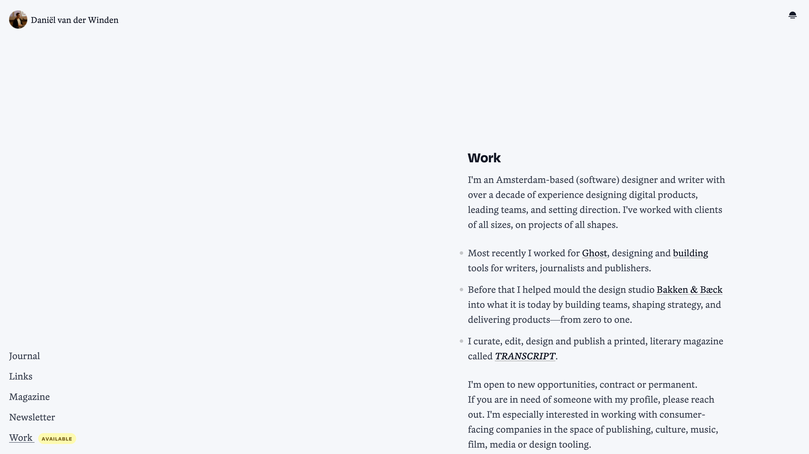

# Daniël van der Winden • Personal Website

A personal website and blog built with Eleventy (11ty) and styled with Tailwind. This site showcases some of my work, some of my writing, and many of my personal interests.

## Overview

It's a static site setup. It features:
- **Eleventy (11ty)** for static site generation
- **Tailwind CSS** with Typography plugin for styling
- **Image optimization** with responsive image shortcodes
- **Dark mode** toggle functionality
- **RSS feed** generation
- **Development workflow** with live reload
- **Analytics integration** with Umami for privacy-focused tracking

## License

Personal website - all rights reserved.

## Contact

- **Email**: d.vanderwinden@gmail.com
- **Website**: [daniel.pizza](https://daniel.pizza)
- **Bluesky**: [@daniel.pizza](https://bsky.app/profile/daniel.pizza)
- **LinkedIn**: [dvdwinden](https://www.linkedin.com/in/dvdwinden/)
- **GitHub**: [dvdwinden](https://github.com/dvdwinden)

